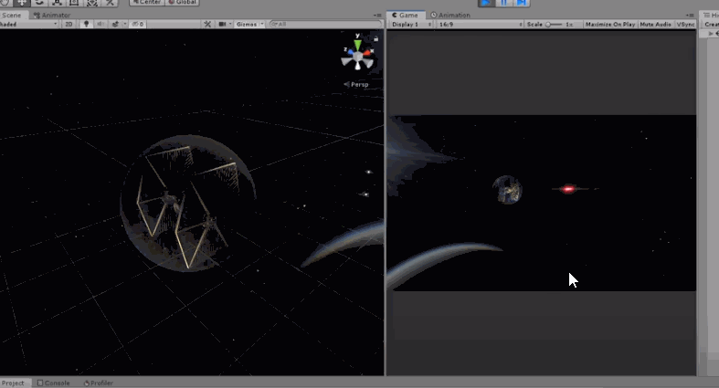

# Shield Shader
## Unity3D Showcase of HLSL Shader

A single Unity example scene with a rippling shield shader for use on translucent spheres. Scene includes a TIE fighter encased in sphere; when the sphere is hit by a ray cast from the spawning lasers a vector of the worldspace impact position is sent to one of the following attached shaders for defining the impact ripple origin: 

"Custom/Shdr_Shield" \\
"Custom/Shdr_Shield_Emissive"

## Video
### Click to watch on youtube

